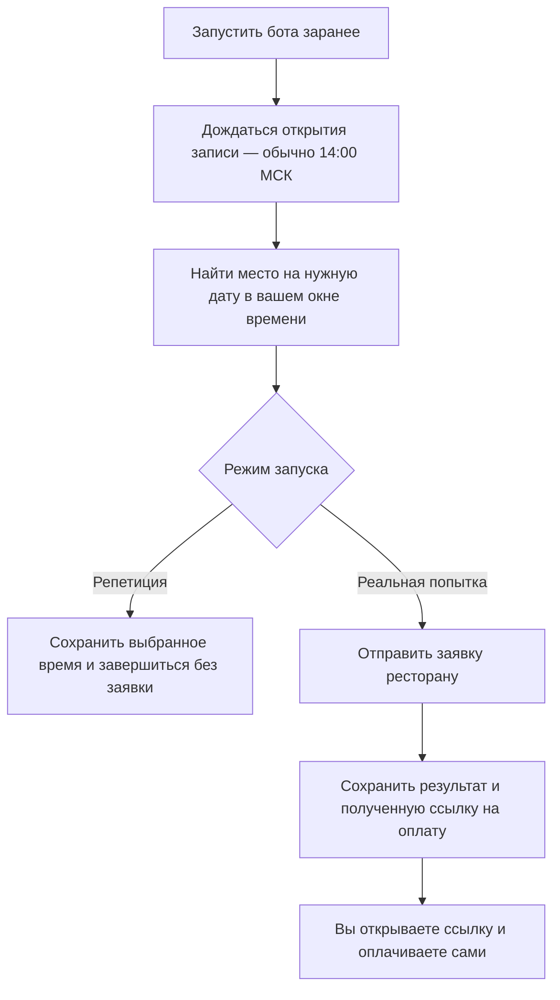

# [VIBECODED]

# Birch booking service

Сервис на Python для **одной брони на новую дату сегодняшнего открытия**
или явно заданную дату в Birch, Санкт-Петербург.
Заранее готовит соединение, ждёт открытия записи, выбирает подходящий слот через
API штатного виджета ReMarked и сохраняет ссылку на оплату. После результата
завершается. Постоянно открытый браузер не требуется.

**Оплату выполняет пользователь в своём браузере.** Сервис не принимает данные
карты и банковские коды. Получение платёжной ссылки не означает подтверждение
брони: удержание столика до оплаты и срок оплаты у Birch пока не проверены.

## Как работает бот

Вы задаёте количество гостей, удобное время визита и контакты, затем запускаете
бота заранее. Он ждёт открытия записи и ищет место на новую дату.



Если вариантов несколько, бот выбирает ближайший к желаемому времени.
Если мест нет, продолжает поиск до конца заданного окна — по текущему конфигу
до 14:01 — и завершается. В репетиции заявка не отправляется; реальная попытка
требует `--live`. Если настроен Telegram, результат реальной попытки придёт туда.

## Быстрый старт

Нужны Python 3.14.x, Poetry 2.2+ и Linux/macOS (используется файловая блокировка `flock`).

```sh
poetry env use 3.14
poetry install
cp -n example_env .env
chmod 600 config.toml .env
```

Если Python 3.14 ещё не установлен, установите его командой
`poetry python install 3.14`. При переходе с предыдущей версии выполните
`poetry env use 3.14` и `poetry install`, затем проверьте `poetry run python --version`.

Заполните `.env`: имя, фамилию, телефон, email и Telegram-логин гостя:

```dotenv
GUEST_FIRST_NAME='Иван'
GUEST_LAST_NAME='Иванов'
GUEST_PHONE='+79991234567'
GUEST_EMAIL='ivan@example.com'
GUEST_TELEGRAM='@username'
```

Локальный запуск автоматически загружает `.env` рядом с выбранным `config.toml`
через `python-dotenv`. Уже заданные переменные окружения имеют приоритет;
подстановка `${VARIABLE}` внутри значений отключена. При `--config /path/config.toml`
используется `/path/.env`, независимо от текущего каталога. Секция `[guest]`
в TOML больше не поддерживается; отсутствующие контакты останавливают запуск
до HTTP-запросов. `example_env` содержит заглушки и отмечает обязательные поля;
`.env` исключён из Git. `config.toml` не содержит контактов, хранится в Git
и содержит пояснение каждого параметра.

В `config.toml` задайте число гостей и время **начала визита**.
По умолчанию `visit_date = "auto"`: дата сегодняшнего открытия выбирается
автоматически. Поле можно опустить или задать явно в формате `YYYY-MM-DD`.
Границы времени включены. Сначала выбирается ближайшее к `preferred_time` время,
при равенстве — зал в порядке `allowed_rooms`, затем более раннее время.
Общий стол и стойка шефа допускаются только соответствующими флагами.

Телефон допускается в форматах `+7…`, `8…` и 10 цифр без префикса. В API уходит
нормализованный номер `+7…`, без удвоения кода страны. `GUEST_TELEGRAM` — логин
для ресторана; он не используется для отправки уведомлений от нашего сервиса.

Режим проверки читает код виджета, получает токен и, если дата уже открыта,
показывает подходящие слоты. Он не отправляет контакты или заявки:

```sh
poetry run python bot.py check
```

Репетиция по расписанию, также **без создания заявки**:

```sh
poetry run python bot.py run
```

Для реальной попытки ознакомьтесь с правилами на
[сайте Birch](https://birchrestaurants.com/saintpetersburg#reserveWidget),
установите оба согласия в `[consents]` и явно добавьте `--live`:

```sh
poetry run python bot.py run --live
```

Запускайте заранее, в день нужного открытия. Например, при запуске **29 сентября
2026** режим `auto` выберет **29 октября 2026**, открытие — в **14:00 по Москве**.
Та же дата может быть задана явно: `visit_date = "2026-10-29"`.
При стандартных настройках подготовка начинается в
13:58, а поиск заканчивается в 14:01. После пропущенного окна сервис сохраняет
`EXPIRED`; он не отправляет неожиданную заявку при позднем запуске.

В [текущем виджете](https://remarked.ru/widget/new/points/270400/custom/reserve/widgetReMarked.min.js?v=10)
список открытых дат не запрашивается с сервера: календарь до 14:00 разрешает
даты до «сегодня + 29 дней», после — до «сегодня + 30», кроме понедельников.
Поэтому горизонт 30 дней хранится в коде как правило Birch; задавать
`days_before_visit` в конфиге больше не требуется. Старое значение `30` совместимо.
Изменение исходного виджета по-прежнему блокирует отправку до проверки контракта.

Режим `auto` фиксирует новую дату при чтении конфига. До открытия слоты не
запрашиваются; после открытия API проверяется только для этой даты. Старые даты
со свободными местами не подставляются. Если новая дата — закрытый понедельник,
запуск завершается с понятной ошибкой до сетевых запросов. Если мест нет,
бот опрашивает выбранную дату до дедлайна. Отдельное серверное подтверждение
«новая дата опубликована» бот не получает: пустой ответ не позволяет отличить
ещё не выложенные места от уже разобранных.

Часовой пояс хоста не влияет на расчёт: используется `Europe/Moscow`. Часы хоста
должны быть синхронизированы системной службой времени. Ноутбук не должен спать.
Внутри ожидания используется прерываемый таймер; интервал опроса измеряется
монотонными часами, одновременно выполняется не более одного запроса.

Токен запрашивается за 15 секунд до открытия, с запасом на задержки авторизации.
Проверка виджета и получение токена допускают по три попытки: при сетевом сбое,
HTTP 408 или 5xx паузы составляют 250 и 500 мс, при 429 учитывается `Retry-After`.
Повторы прерываются сигналом остановки и ограничены концом окна поиска;
исчерпание окна подготовки даёт `READ_FAILED`. Команда `check` использует те же
повторы с бюджетом `max_poll_seconds` от начала проверки. Изменение виджета,
некорректный токен/JSON и остальные HTTP 4xx не повторяются. Создание заявки
этими повторами не затрагивается.
Журнал показывает длительность авторизации и фактическую задержку старта. В текущем
конфиге `poll_interval_ms = 50` — минимальный интервал между началами запросов.
Если ответ идёт дольше 50 мс, следующий запрос начинается после его получения;
дополнительная пауза на 50 мс не добавляется. Запросы остаются последовательными,
`Retry-After` соблюдается. Локальные замеры 29.09.2026 проводились вне момента
открытия записи и не устанавливают разрешённую частоту или задержки под нагрузкой.
Отчёт, если сохранён на этой машине: `reports/api-2026-09-29/report.md`.

Бенчмарк находится в `tests/benchmarks/benchmark.py` и не запускается через pytest.
Отчёты в `reports/` локальные и исключены из Git. Для повторения из обычного
терминала задайте актуальную дату, на которую уже открыта запись:

```sh
poetry run python - <<'PY'
from tests.benchmarks.benchmark import run
booking = {"visit_date": "2026-10-28", "guests": 2}
run("reports/repeated-api.json", booking)
PY
```

Это до 294 реальных запросов токена/слотов в трёх сериях. Для отдельной минуты
опроса с интервалом 50 мс используйте `run("reports/sustained-api.json", booking,
sustained=True)` — до 1201 запроса, включая токен. Первый отказ завершает прогон;
создание заявки и отправка контактов в бенчмарке отсутствуют.

## Запуск как сервис в Docker

Нужен запущенный Docker Engine; на macOS запустите Docker Desktop. После
заполнения локальных `config.toml` и `.env`:

```sh
export BOOKING_UID=$(id -u)
docker compose build
docker compose run --rm booking check
docker compose up -d
docker compose logs -f booking
```

`up -d` запускает ожидание в фоне. Закрытие терминала ему не мешает, но сон
компьютера приостанавливает Docker Desktop. Сервис не изменяет настройки сна.
Остановить ожидание можно командой `docker compose stop booking`; SIGTERM
прерывает ожидание, а уже выполняющийся HTTP-запрос ограничен своим таймаутом.
Для разовой репетиции с выводом в терминал: `docker compose run --rm booking run`.
Не запускайте её одновременно с фоновым контейнером: общий том защищён блокировкой.

По умолчанию Compose запускает репетицию. Для реальной попытки измените
`command` в `compose.yaml` на `["run", "--live"]`, затем выполните
`docker compose up -d`. Состояние хранится в постоянном томе `booking-data`.
Сервис работает от непривилегированного пользователя. После результата
контейнер штатно останавливается; автоматический перезапуск выключен.
Compose передаёт `GUEST_*` и Telegram-настройки из `.env` через окружение.
Файл `.env` не копируется в образ и не монтируется в контейнер.
`BOOKING_UID` должен совпадать с владельцем `config.toml`, чтобы контейнер мог
прочитать конфиг с правами `600`. Сохраните это значение в `.env` для последующих
сборок. При повторном использовании тома сохраняйте тот же UID.

Посмотреть результат, включая ссылку на оплату:

```sh
docker compose run --rm booking status --live
# Для локального запуска:
poetry run python bot.py status --live
```

У репетиции отдельный файл состояния; для её результата используйте `status`
без `--live`. В режиме `auto` следующий запуск в другой московский день выберет
дату нового открытия без правки конфига. Автоматического ежедневного запуска нет.
Команда `status` с `auto` также относится к сегодняшнему открытию; для результата
предыдущего дня укажите в конфиге фактическую дату визита.

## Уведомление со ссылкой на оплату

Необязательно: задайте **оба** `TELEGRAM_BOT_TOKEN` и `TELEGRAM_CHAT_ID` в окружении
процесса или в `.env`. Предварительно начните диалог с вашим
Telegram-ботом и укажите числовой chat ID нужного чата. `.env` не попадает в Git
и Docker-образ; установите ему права `600`.

Получение параметров для личного чата:

1. Откройте [@BotFather](https://t.me/BotFather), отправьте `/newbot` и пройдите
   создание бота. Выданный токен — значение `TELEGRAM_BOT_TOKEN`.
2. Откройте созданного бота и отправьте ему `/start`.
3. Задайте токен в окружении и прочитайте входящие сообщения:

   ```sh
   export TELEGRAM_BOT_TOKEN='токен от BotFather'
   curl --silent --show-error "https://api.telegram.org/bot${TELEGRAM_BOT_TOKEN}/getUpdates"
   ```

   Найдите собственное сообщение в `result` и скопируйте его `message.chat.id`
   в `TELEGRAM_CHAT_ID`. Если `result` пуст, отправьте новое сообщение и повторите
   запрос. Для нового бота webhook не требуется; у существующего бота активный
   webhook препятствует `getUpdates`.

Для локального запуска и Docker Compose сохраните оба значения в `.env`:

```dotenv
TELEGRAM_BOT_TOKEN=токен_от_BotFather
TELEGRAM_CHAT_ID=числовой_id_чата
```

При локальном запуске файл загружается автоматически; `export` нужен только
для переопределения значений. `GUEST_TELEGRAM` остаётся контактом для ресторана.
Источники: [создание бота](https://core.telegram.org/bots/tutorial#obtain-your-bot-token),
[getUpdates](https://core.telegram.org/bots/api#getupdates).

В режиме `--live` сервис отправляет итоговый статус. При получении ссылки
сообщение содержит дату, время, зал, гостей, сумму и ссылку. Откройте её сами,
проверьте данные на платёжной странице и оплатите. Банковская страница сервисом
не открывается. Репетиция уведомления не отправляет. При сбое Telegram ссылка
остаётся в файле состояния; повторная заявка ради уведомления не создаётся.

## Результаты и защита от дублей

| Статус | Значение |
| --- | --- |
| `DRY_RUN_MATCH` | Репетиция нашла слот; заявка не отправлялась |
| `AWAITING_PAYMENT` | Получена HTTPS-ссылка на самостоятельную оплату |
| `ACCEPTED_WITHOUT_PAYMENT_LINK` | API принял заявку без ссылки; нужна ручная проверка |
| `SUBMITTING` | Отправка начата; после аварийного завершения повтор запрещён |
| `UNKNOWN` | Результат отправки неизвестен; проверить у ресторана |
| `SLOT_TAKEN` | Сервер явно сообщил, что слот занят; можно выбрать другой |
| `REJECTED` | API явно отклонил заявку |
| `NO_SLOTS` | Опрос завершён без выбора слота, последнее чтение успешно |
| `READ_FAILED` | Истёк бюджет подготовки либо опрос завершился ошибкой чтения |
| `EXPIRED` | Окно запуска уже закончилось |

До HTTP-запроса создания заявки состояние записывается с `fsync`, замена файла
атомарная. После `UNKNOWN` или `SUBMITTING` перезапуск **не повторяет отправку**.
`request_id` используется для диагностики; гарантия идемпотентности сервера не
предполагается. На `5xx`, `429`, сетевой ошибке или некорректном ответе именно
создания заявки сервис останавливается с `UNKNOWN`.

Автоматическая следующая попытка разрешена только после явного ответа
`Slot is not free`. Для чтения слотов соблюдается `Retry-After`. Лист ожидания
и групповые заявки не создаются. Сервис не объявляет бронь подтверждённой:
подтверждение после оплаты проверяет пользователь.

Строка `Slot is not free` взята из обработчика ответа `CreateReserveAfterPayment`
в коде виджета. Сам виджет при ней обновляет слоты и возвращается к выбору.
Чтение через `GetBookingsSlots` передаёт дату и количество гостей; затем бот
фильтрует ответ по времени, залам и посадке. Между чтением и отправкой место
могут занять, поэтому явный конфликт обрабатывается отдельно.
В календаре виджета понедельники запрещены начиная с 25 января 2026 года
условием `date >= 2026-01-25 && date.getDay() === 1`. Причина запрета в коде
не указана; бот следует этому ограничению формы.

Используйте **один экземпляр и одну папку/том состояния**. `flock` защищает от
одновременных процессов с общим состоянием, но отдельные машины/тома друг о
друге не знают. Не удаляйте файл состояния и не запускайте в новой папке, пока
не проверили результат предыдущей попытки. Успешное повторное выполнение той же
задачи остановится на сохранённом результате.

## Диагностика

Журнал пишется в stderr: одна JSON-запись на строку, время в UTC с явным `+00:00`.
`run_id` связывает события одного запуска, `request_id` — запрос и сохранённое
состояние заявки. `stage` показывает этап, `poll_attempt` — номер опроса.
В Docker используйте `docker compose logs booking`. Локально журнал можно
сохранить командой `poetry run python bot.py run 2>>booking.log`.
`check` и `status` также печатают результат в stdout; Compose объединяет оба
потока и добавляет префикс контейнера, поэтому весь его вывод не является JSONL.

`stage_started/completed/failed` показывают этапы и длительности; `first_slot_request`
содержит `opening_lag_ms` — задержку первого опроса относительно открытия.
`slots_filtered` содержит число полученных/подходящих слотов и счётчики причин
отсева: дата, время, зал, общий стол, стойка шефа, ранее занятый слот. Один слот
учитывается по первой причине отказа. `slot_selected` фиксирует выбранную посадку.
`visit_date_selected` фиксирует автоматически выбранную дату, `date_mode` и источник правила;
это расчёт по календарю виджета, а не сообщение сервера об открытии записи.
Поле `mode` во всех событиях означает режим запуска: `dry-run` или `live`.
`preparation_retry` показывает этап, номер неудачной попытки и паузу перед
следующей; `preparation_retries_exhausted` — исчерпание трёх попыток.
`poll_finished` показывает количество попыток и успешных чтений, а при завершении
по дедлайну — `last_read_succeeded`. Если после успешного чтения API перестал
отвечать до конца окна, итог — `READ_FAILED`, а не вывод об отсутствии мест.

`api_request_started/completed/failed` записываются также при таймауте. Ошибки
содержат тип и места в стеке без текста исключения и локальных переменных.
`api_response_invalid` различает отсутствующий/некорректный токен, отказ чтения
слотов и отсутствие поля `slots`; `payment_link_invalid` — некорректную ссылку
на оплату, в том числе ошибочный тип или синтаксис URL.
`state_save_failed` показывает операцию записи, `errno` и статус сохраняемой
заявки; этап различает сбой до отправки и после неё. Для Telegram сохраняются
HTTP-статус, тип ошибки, безопасный числовой код API и категория сбоя. Сигналы
остановки видны как `stop_requested`; завершение — как `run_finished`.

Контакты, токены, платёжные ссылки и полные ответы API в журнал не записываются.
Для неизвестного отказа ReMarked сохраняются числовой код (если он предоставлен)
и SHA-256 сообщения, позволяющий сопоставить одинаковые отказы; произвольный
текст сервера не выводится, поскольку он может содержать личные данные.
При `UNKNOWN` даже подробный журнал не доказывает наличие или отсутствие заявки
на сервере. Бот не повторяет отправку; результат нужно проверить у ресторана.

## Контракт Birch и ограничения

Проверен публичный виджет от **29.09.2026**, `point=270400`:
`GetToken` → `GetBookingsSlots` → `CreateReserveAfterPayment`.
Чтение токена и слотов проверено на реальном API. Создание заявки и оплату на
реальном ресторане в ходе разработки не выполняем; они проверяются на имитации API.

Автоматического обновления токена во время опроса нет: отказ API виден в журнале
и может завершить запуск. Уведомление Telegram отправляется один раз, без
автоматических повторов; его сбой не меняет сохранённый результат и код завершения
бронирования. Потерянная или некорректная ссылка на оплату автоматически не
восстанавливается — проверьте результат у ресторана перед новой попыткой.

Перед попыткой сверяются ссылки на скрипты в странице ресторана и SHA-256 двух
файлов виджета. Если форма изменится, сервис остановится до отправки контактов.
После изменений нужно проверить правила и контракт, обновить `ASSETS` в
`src/remarked.py` и проверки. Не обновляйте хеши автоматически или вслепую.

Текущий код виджета требует предоплату 9 500 ₽ на гостя для обычных актуальных
дат. `max_deposit_rub` ограничивает сумму **запрашиваемой ссылки**, а не списание
с карты. Сервер может изменить платёжные условия независимо от клиентского
кода; сумму на странице оплаты пользователь проверяет самостоятельно.
Обычный сценарий поддерживает 1–7 гостей. Для 6–7 гостей правила предусматривают
сервисный сбор 10% в итоговом счёте. Понедельники исключены даже при наличии
слотов в API, поскольку календарь сайта их запрещает. Горизонт — 30 календарных
дней. Можно задать более позднее время запуска, но не раньше 14:00 МСК.

Полные HTTP-ответы, токены ReMarked и контакты в журнал не выводятся. Платёжная
ссылка хранится в файле с правами `600`, контакты берутся из `.env` или окружения.
Файл с платёжной ссылкой и сообщения Telegram следует считать приватными.

## Структура кода

В корне `bot.py` только вызывает точку входа. Логика находится в `src`:

- `cli.py` — команды, аргументы и настройка процесса.
- `config.py` — чтение конфига, валидация и нормализация телефона.
- `rules.py` — календарь Birch, предоплата и выбор слота.
- `remarked.py` — клиент API и проверка контракта виджета.
- `service.py` — подготовка, ожидание открытия и попытка бронирования.
- `storage.py` — сохранение состояния и блокировка процесса.
- `notifications.py` — уведомления Telegram.
- `diagnostics.py` — JSON-журнал и контекст этапов/запросов.

Зависимости задаются в `pyproject.toml`, точные версии фиксируются в `poetry.lock`.
Poetry управляет зависимостями приложения без сборки отдельного Python-пакета.

## Проверки

Тесты повторяют структуру исходного кода: для `src/cli.py` проверки находятся в
`tests/src/test_cli.py`. Общие фикстуры и переиспользуемый код — в `tests/conftest.py`.
Тесты оформляются только функциями с именами `test_<имя функции>_<что проверяет>`.
Они используют собственный временный конфиг и тестовые контакты, не читают
рабочие `config.toml` и `.env`, не зависят от текущей даты и не обращаются в сеть.

```sh
poetry check --lock
poetry run pytest
git diff --check
# Для отдельного модуля:
poetry run pytest tests/src/test_cli.py
```

Pytest находится в группе зависимостей `test` и устанавливается через `poetry install`.
Docker устанавливает только группу `main`, поэтому pytest в образ не входит.
Используются фикстуры pytest и `httpx.MockTransport`, реальные заявки
не создаются. Проверяются календарная дата открытия, префикс телефона, время и
посадка, денежный payload, репетиция, конфликт слотов, потеря ответа, перезапуск,
лимиты API, пропущенное окно и изменение виджета. Также проверяются лимит
предоплаты и согласия до HTTP-запросов, запрет повторной заявки после ошибок
записи состояния, отмена и завершение опроса, команды CLI и сбои уведомлений.

Проверка контейнера: `docker compose build`, затем `docker compose run --rm booking check`
и `docker compose run --rm booking run`. До открытия второй сценарий ждёт
расписания; после пропущенного окна завершается с `EXPIRED`. Успешный `check`
не доказывает создание брони, а тесты с имитацией API не подтверждают наличие
свободных мест на реальном сайте.

История изменений — в [CHANGELOG.md](CHANGELOG.md).
